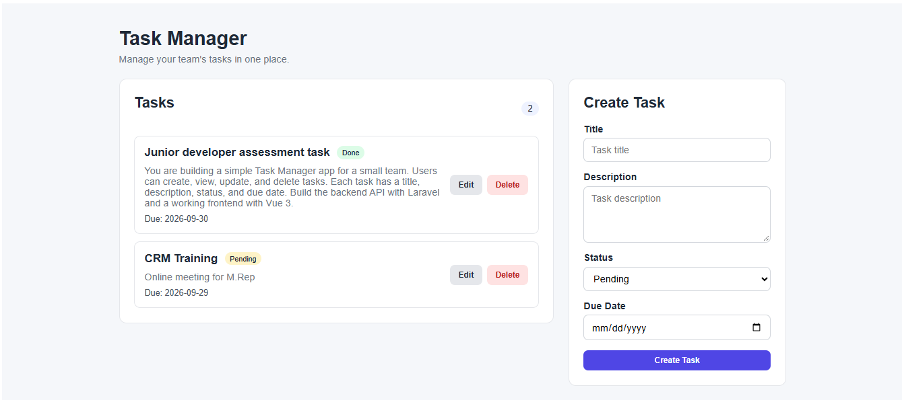

# Task Manager

A simple task management application built with Laravel and Vue 3.

The application allows users to create, view, update, and delete tasks through a Laravel REST API and a Vue 3 frontend.

## Preview

### Screenshot



### Demo Video

[Watch the Operations](docs\Operations.mp4) , [Watch the validation](docs\Validation.mp4)

## Features

- View all tasks
- Create a task with client-side and server-side validation
- Update task status and due date
- Delete a task with confirmation
- Loading, empty, and error states
- Responsive basic UI
- REST API under `/api/tasks`
- Feature test for task creation

Each task contains:

- Title
- Description (optional)
- Status: `pending`, `in_progress`, or `done`
- Due date

## Tech Stack

- PHP 8.3+
- Laravel 13
- Vue 3
- Vite
- MariaDB / MySQL
- Pest

## Installation

Clone the repository and enter the project directory:

```bash
git clone https://github.com/muhhammedeid/Task-Manager.git
cd Task-Manager
```

Install PHP and JavaScript dependencies:

```bash
composer install
npm install
```

Create the environment file:

### Windows

```bat
copy .env.example .env
```

### Linux / macOS

```bash
cp .env.example .env
```

Generate the application key:

```bash
php artisan key:generate
```

## Database Setup

Create a MariaDB or MySQL database, then update the database values in `.env`:

```env
DB_CONNECTION=mariadb
DB_HOST=127.0.0.1
DB_PORT=3306
DB_DATABASE=task_manager
DB_USERNAME=your_database_user
DB_PASSWORD=your_database_password
```

Run the migrations and seeders:

```bash
php artisan migrate --seed
```

## Run the Application

Start Laravel:

```bash
php artisan serve
```

Start Vite in another terminal:

```bash
npm run dev
```

Then open:

```text
http://127.0.0.1:8000
```

If port 8000 is already in use, Laravel can be started on another port:

```bash
php artisan serve --port=8001
```

## API Endpoints

| Method | Endpoint | Description |
| --- | --- | --- |
| GET | `/api/tasks` | List all tasks |
| POST | `/api/tasks` | Create a task |
| GET | `/api/tasks/{task}` | View one task |
| PATCH / PUT | `/api/tasks/{task}` | Update a task |
| DELETE | `/api/tasks/{task}` | Delete a task |

## Run Tests

```bash
php artisan test
```

The project includes a feature test for the task creation API endpoint.

## Build for Production

```bash
npm run build
```
